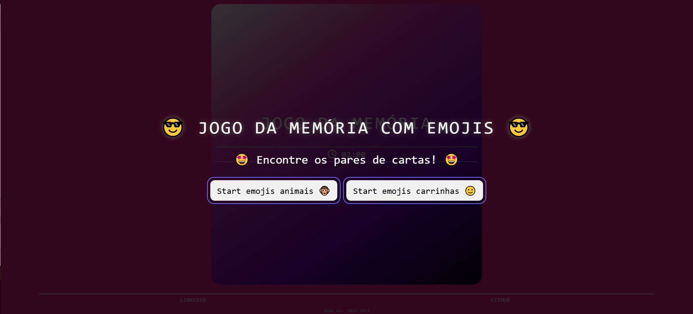

# 🧠 Jogo da Memória de Emojis

Um jogo da memória interativo e totalmente responsivo desenvolvido com **HTML**, **CSS** e **JavaScript**, que desafia o jogador a encontrar todos os pares de emojis antes que o tempo acabe. Escolha entre dois temas divertidos — **Animais** ou **Carrinhas** — e teste sua memória!

## 🕹️ Como jogar

1. Ao iniciar, você verá a tela inicial com o título do jogo e duas opções:

   * 🐶 Emojis de **Animais**
   * 🙂 Emojis de **Carrinhas**

2. Após selecionar o tema, o jogo começa imediatamente:

   * Você terá **2 minutos** para encontrar todos os pares.
   * Clique nas cartas para revelá-las e tentar formar pares.

3. O jogo termina de duas formas:

   * ✅ **Vitória**: ao encontrar todos os pares antes do tempo acabar.

     * Uma tela de parabéns será exibida com o **tempo total gasto** e duas opções:

       * Jogar novamente
       * Voltar à tela inicial
   * ❌ **Derrota**: se o tempo acabar antes de encontrar todos os pares.

     * Uma tela de **Game Over** é exibida com as mesmas opções.

## 💻 Tecnologias utilizadas

* **HTML5**: estrutura do projeto
* **CSS3**: estilização com responsividade e design amigável
* **JavaScript**: lógica do jogo, manipulação de tempo e interações

## 📱 Responsividade

O projeto foi desenvolvido com o conceito **Mobile First**, garantindo uma experiência de jogo fluida em qualquer dispositivo — seja no celular, tablet ou desktop.

## 📷 Prévia




## 🚀 Como executar localmente

1. Clone este repositório:

   ```bash
   git clone https://github.com/seu-usuario/jogo-da-memoria-emojis.git
   ```

2. Navegue até a pasta do projeto:

   ```bash
   cd jogo-da-memoria-emojis
   ```

3. Abra o arquivo `index.html` no seu navegador.

---

## 📄 Licença

Este projeto está sob a licença MIT. Consulte o arquivo `LICENSE` para mais detalhes.

## 🏆 Créditos

Este projeto foi desenvolvido como parte de um desafio educacional da [Digital Innovation One](https://web.digitalinnovation.one/).

---

Aproveite e divirta-se com o **Jogo da Memória de Emojis**!
Se curtir o projeto, não esqueça de deixar uma ⭐️ no repositório!

---